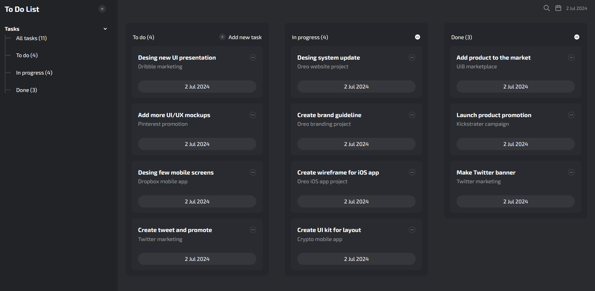

# To Do List Dashboard

This project is a task management application designed to help users efficiently organize and track their tasks. The application includes features for displaying the current date, toggling modal visibility, handling a side navigation bar, adding tasks, updating the task list, and managing task states with local storage integration.

## Demo

[To Do List Live Demo](https://mdurandop.github.io/to-do-list-dashboard/)

## Features

- **Display Current Date:** The application displays the current date using the dayjs library.
- **Toggle Modal Visibility:** Users can open and close modals for adding new tasks.
- **Side Navigation Bar:** The application includes a collapsible side navigation bar for easy access to different sections.
- **Add Tasks:** Users can add new tasks with a name and description.
- **Update Task List:** The task list is dynamically updated to reflect the current tasks, with a count of tasks to be completed.
- **Task Management:** Users can mark tasks as complete, in progress, or delete them.
- **Local Storage Integration:** Tasks are stored in the browser's local storage, ensuring that task data persists across sessions.

## Screenshots

## Authors

- Desing inspired by: [@mehdi.uix](https://www.instagram.com/mehdi.uix)
- Developed by: [@ingeaeri](https://twitter.com/ingeaeri)
